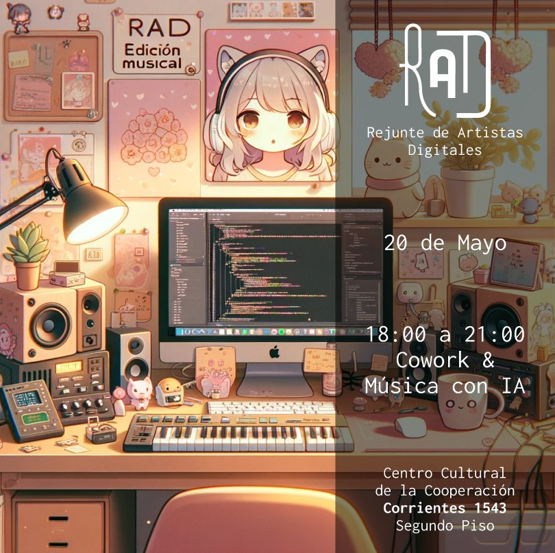

# Musicalizador

RAD es un espacio de cowork para gente interesada en las artes digitales. La idea de este encuentro es sumarle a la dinámica usual de trabajo una actividad de ambientación generativa. Utilizaremos plataformas de generación musical como suno.com y udio.com para crear música ambiental tranquila que sonorizará la juntada.



## Detalles técnicos

- `canciones-bot.py`: Corre un bot de telegram que guarda la canciones que le manden y la suma a la lista de canciones en `playlist.txt`
- `playlist.py`: Corre un script que chequea constantemente `playlist.txt` para ver que canción tocar próxima

### Como ejecutar el bot?

```bash
python -m pip install -r requirements.txt
python canciones-bot.py # Esto queda corriendo por siempre
python playlist.py # Esto queda corriendo por siempre en otra terminal
```

## Resultados

[Estas](https://drive.google.com/drive/folders/1EGkQ1vYXj5MgcnLO4A48m-kN2JaJkAdU?usp=sharing) fueron las canciones generadas durante la juntada.

## Protocolo

El día de la juntada seguí estos pasos
1. Crea tantas canciones como quieras desde suno o udio, trae auriculares para ir escuchando los resultados en silencio
2. Cuando una canción te guste mandale el mp3 al bot de telegram @MusiquitaAIBot
3. Ya esta! La canción se sumará automáticamente a una playlist que estará sonando en loop durante la juntada.

Nota: Las canciones son de temática libre, se incentiva a explorar e inventar géneros y sonidos, solo tene en cuenta que algunos estarán trabajando o charlando mientras se hace la actividad. Intenta hacer canciones ambientales que no sean muy intensas o muy cargadas con voces/letras que distraigan

Pueden buscar inspiración e ideas de generos en:
- https://everynoise.com/
- https://suno.com/explore
- https://www.udio.com/